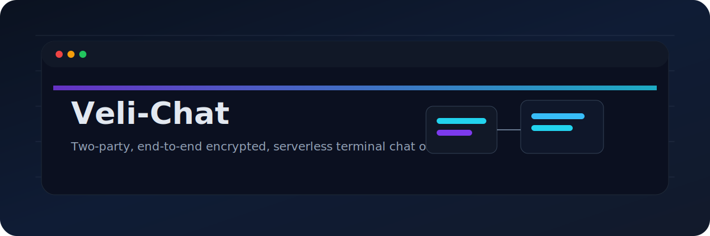
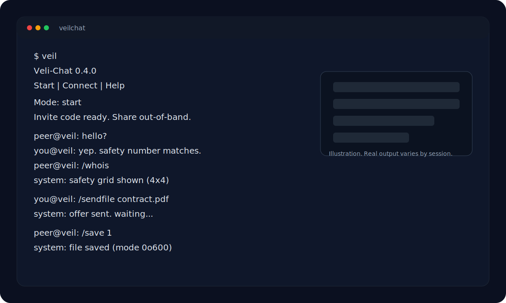
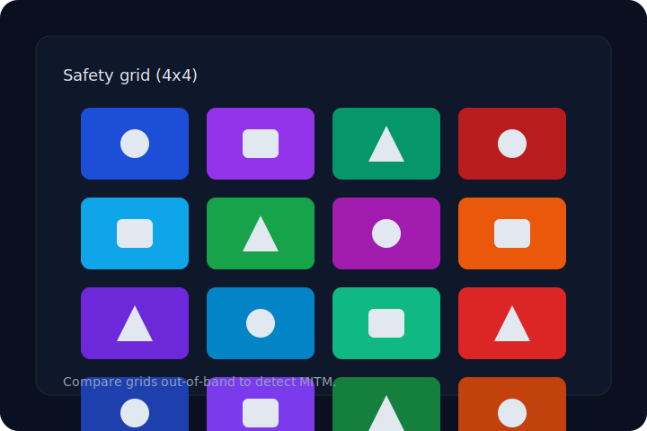
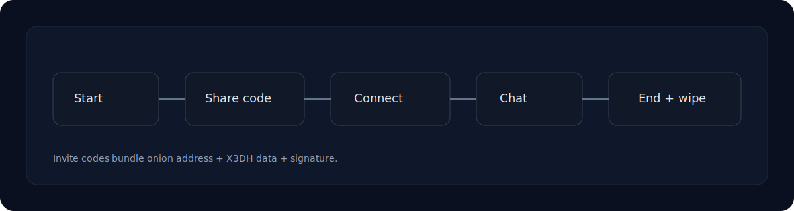
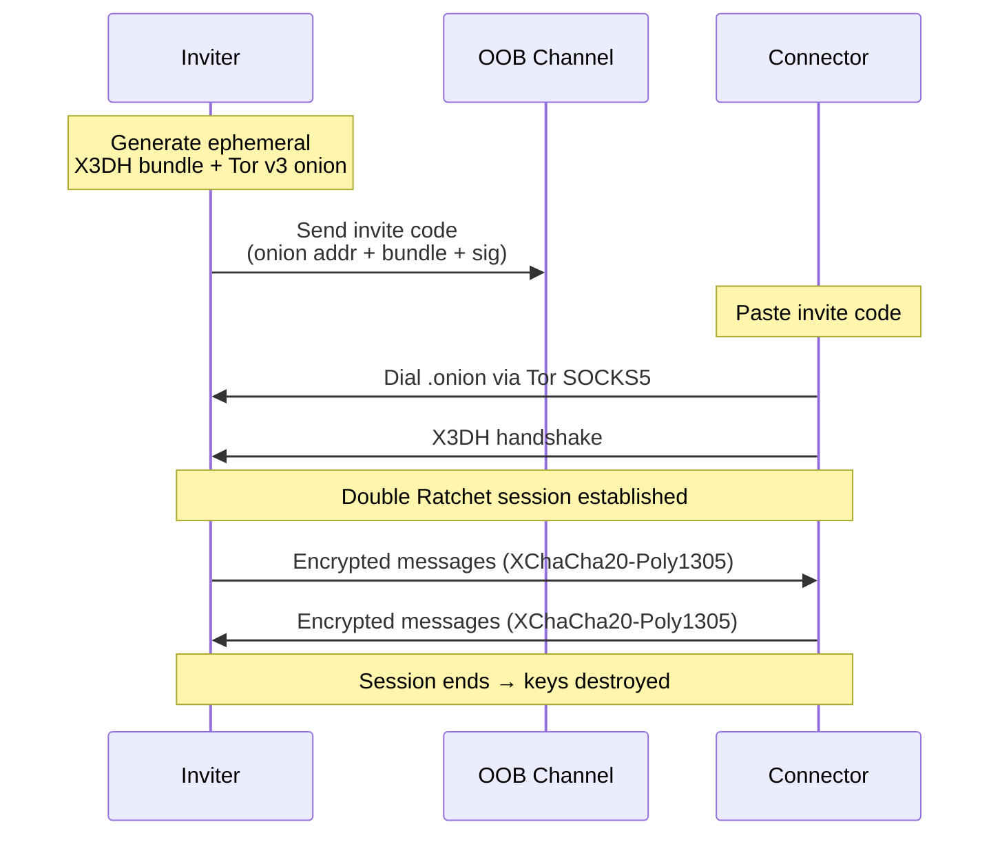

<p align="center">
  <pre>
██╗   ██╗███████╗██╗██╗      ██████╗██╗  ██╗ █████╗ ████████╗
██║   ██║██╔════╝██║██║     ██╔════╝██║  ██║██╔══██╗╚══██╔══╝
██║   ██║█████╗  ██║██║     ██║     ███████║███████║   ██║
╚██╗ ██╔╝██╔══╝  ██║██║     ██║     ██╔══██║██╔══██║   ██║
 ╚████╔╝ ███████╗██║███████╗╚██████╗██║  ██║██║  ██║   ██║
  ╚═══╝  ╚══════╝╚═╝╚══════╝ ╚═════╝╚═╝  ╚═╝╚═╝  ╚═╝   ╚═╝
  </pre>
</p>

<p align="center">
  <strong>Two-party · End-to-end encrypted · Serverless · Ephemeral terminal chat over Tor</strong>
</p>

<p align="center">
  <a href="./LICENSE"></a>
  <a href="https://github.com/Dev-Lahrani/Veli-Chat/actions/workflows/ci.yml"></a>
  
  = 22" />
  
  
  
</p>

<p align="center">
  
</p>

<p align="center">
  <a href="#quick-start">Quick start</a> |
  <a href="#features">Features</a> |
  <a href="#security--threat-model">Security</a> |
  <a href="#tests">Tests</a>
</p>

---

## Visual preview

Lightweight SVG illustrations (not screenshots).

| Terminal preview | Safety grid | Invite flow |
|---|---|---|
|  |  |  |

---

## Quick facts

| Property | Value |
|---|---|
| Session | Two-party, ephemeral |
| Storage | RAM only; wiped on exit |
| Transport | Tor v3 onion (default) |
| Cryptography | X3DH + Double Ratchet |
| Wire obfuscation | Padded frame buckets |
| CLI runtime | Node.js 22+, pnpm 9 |

---

## Architecture



```
┌────────────────────────────────────────────────────┐
│                    Inviter                          │
│  ┌─────────┐   ┌──────────┐   ┌────────────────┐   │
│  │ X3DH    │──▶│ Tor v3   │──▶│ Padded         │   │
│  │ Bundle  │   │ Onion    │   │ Transport      │   │
│  └─────────┘   │ Service  │   │ (6 bucket      │   │
│                └──────────┘   │  sizes)        │   │
│                              └────────────────┘   │
└────────────────────┬───────────────────────────────┘
                     │ invite code
                     ▼
              ┌──────────────┐
              │   OOB        │  (Signal, voice, QR, etc.)
              │   Channel    │
              └──────────────┘
                     │
                     ▼
┌────────────────────────────────────────────────────┐
│                   Connector                         │
│  ┌────────────────┐   ┌──────────┐   ┌──────────┐  │
│  │ Parse invite   │──▶│ Tor      │──▶│ X3DH     │  │
│  │ Code           │   │ SOCKS5   │   │ Handshake│  │
│  └────────────────┘   │ Dial     │   └──────────┘  │
│                       └──────────┘                  │
└────────────────────────────────────────────────────┘
```

### Wire format

Every TCP frame is padded to one of six fixed bucket sizes:

| Bucket | Usage |
|--------|-------|
| 256 B  | Typing indicators, ACKs |
| 1 KiB  | Short messages |
| 4 KiB  | Average messages |
| 16 KiB | Long messages |
| 64 KiB | File chunks |
| 256 KiB| Max file chunk |

An on-path observer sees **no information** about the real payload size.

---

## Features

| Category | Feature | Details |
|---|---|---|
| **🔐 Cryptography** | X3DH + Double Ratchet | Forward secrecy & post-compromise security via `@noble/*` audited primitives |
| | XChaCha20-Poly1305 | AEAD encryption for every message |
| | Ed25519 signatures | Identity binding within invite codes |
| | BLAKE2b fingerprints | MITM detection via safety numbers |
| **🕵️ Anonymity** | Tor v3 onion services | Neither peer's IP is exposed |
| | No accounts | No usernames, no identifiers, no persistence |
| | Ephemeral identities | Fresh keypair every session |
| **🛡️ Anti-surveillance** | Padded transport | 6 fixed bucket sizes — wire bytes leak nothing |
| | Cover traffic | `--cover` sends jittered noop frames (30–90 s) |
| | Stealth mode | `--stealth` / `/stealth` masks names for screen sharing |
| | Alt screen buffer | `--alt-screen` — zero scrollback after exit |
| | Panic button | `/panic` clears screen + kills session instantly |
| | Sanitized errors | `scrub()` redacts keys, onion addresses, base64 from stderr |
| **💬 Chat** | Markdown rendering | `**bold**`, `*italic*`, `` `code` ``, fenced blocks, quotes |
| | File transfer | `/sendfile` → `/save` / `/reject` — 16 MiB cap, RAM only |
| | `/sha <id>` | SHA-256 before saving — verify file integrity OOB |
| | Typing indicators | Opt-in (`/typing on`) |
| | Read receipts | Opt-in (`/receipts on`) |
| | Safety number grid | 4×4 colored shapes — eye-comparable on video calls |
| | Per-name colors | djb2-hashed name palette |
| | Tab completion | Every slash command |
| | End-of-session summary | Sent/received counts and duration |
| **📦 Lifecycle** | No disk writes | Keys, ratchet state, history in memory only |
| | Idle auto-quit | `--idle-minutes N` with 60 s grace countdown |
| | Tor bootstrap progress | Every 10 % milestone shown in themed status line |

---

## Quick start

### Prerequisites

- **Node.js** 22+
- **pnpm** 9

```bash
# Install dependencies
pnpm install

# Build both packages
pnpm build

# Start the app
pnpm start
```

### LAN mode (no Tor — for testing only)

```bash
pnpm start -- --lan
```

> ⚠️ LAN mode binds to loopback and provides **zero anonymity**. Only use on trusted networks.

### Install globally (once published)

```bash
npm i -g veilchat
veil
# or
npx veilchat
```

---

## CLI flags

| Flag | Effect |
|---|---|
| `--lan` | LAN-only mode (no Tor — testing only) |
| `--lan-host <addr>` | Bind address for LAN mode (default: `127.0.0.1`) |
| `--lan-port <port>` | Port for LAN mode |
| `--mode start\|connect\|help` | Skip the interactive menu |
| `--code <invite>` | Preset invite code (for connect mode) |
| `--name <display>` | Preset display name |
| `--idle-minutes N` | Auto-quit after N idle minutes |
| `--cover` | Send opaque cover-traffic frames |
| `--stealth` | Start in stealth mode (mask names) |
| `--alt-screen` | Run in alternate screen buffer |

---

## In-chat commands

| Command | Effect |
|---|---|
| `/help` | Full command list |
| `/whois` | Safety number, visual grid, key fingerprints |
| `/name <new>` | Rotate display name (broadcast to peer) |
| `/clear` | Wipe terminal scrollback (session continues) |
| `/copy` | Copy safety number to clipboard via OSC-52 |
| `/stealth` | Toggle name masking for screen sharing |
| `/panic` | Clear screen + drop session immediately |
| `/typing on\|off` | Opt-in typing indicators |
| `/receipts on\|off` | Opt-in read receipts |
| `/sendfile <path>` | Offer a file (max 16 MiB) |
| `/files` | List received files |
| `/sha <id>` | SHA-256 of received file before saving |
| `/save <id> [path]` | Save received file to disk (mode 0o600) |
| `/reject <id>` | Drop an in-progress receive |
| `/quit` | End session and wipe all state |

Tab completion works on every command.

---

## How it works

1. **Start** → generates an ephemeral X3DH identity bundle + ephemeral Tor v3 onion service. Produces a single invite code string combining the `.onion` address + bundle + signature.
2. **Share** → hand the code to the other person out-of-band (Signal, QR, in-person, encrypted DM).
3. **Connect** → paste the code. Dial the `.onion` via the embedded Tor SOCKS5 proxy. Complete X3DH key exchange. A Double Ratchet session begins.
4. **Chat** → every message is encrypted (XChaCha20-Poly1305), framed over the onion connection, decrypted on the other side. Both sides see a safety number — read it aloud to verify no MITM.
5. **End** → `/quit` or Ctrl-C destroys the session, tears down the onion service, wipes all keys and chat history from memory. Nothing touches disk.

### Verification ritual

```text
1. Both peers run /whois after connecting
2. Read the safety number aloud (or compare visual grids on video call)
3. If they match → secure
4. If they DON'T match → /quit immediately, use a different OOB channel
```

---

## Security & threat model

See **[SECURITY.md](./SECURITY.md)** for the full breakdown.

| Protected against | Mechanism |
|---|---|
| Message confidentiality | Double Ratchet AEAD (XChaCha20-Poly1305) |
| Forward secrecy | Symmetric chain rotates per message; DH ratchet on every reply |
| Post-compromise security | DH ratchet — compromise of current keys doesn't decrypt future messages |
| MITM | Out-of-band safety-number + 4×4 color/shape grid verification |
| IP leaks | Tor v3 onion services on both ends |
| Disk seizure | **Nothing on disk** — keys, state, history die with the process |
| Correlation | Fresh identity every session; no accounts or stable IDs |
| Wire-size analysis | Padded transport — 6 fixed bucket sizes |
| Timing analysis | `--cover` — jittered encrypted noop frames |
| Terminal injection | ANSI/control-char stripping on every received message |

### Cryptographic primitives

| Primitive | Library |
|---|---|
| X25519 DH | `@noble/curves/ed25519` |
| Ed25519 signatures | `@noble/curves/ed25519` |
| XChaCha20-Poly1305 AEAD | `@noble/ciphers` |
| HKDF-SHA256 | `@noble/hashes` |
| HMAC-SHA256 | `@noble/hashes` |
| BLAKE2b (fingerprints) | `@noble/hashes` |

All primitives are constant-time and side-channel-aware (per noble's audit).

---

## Project layout

```
veilchat/
├── packages/
│   ├── protocol/          X3DH + Double Ratchet primitives
│   │   ├── src/
│   │   │   ├── crypto.ts          Low-level AEAD, DH, HKDF
│   │   │   ├── identity.ts        Ed25519 identity creation
│   │   │   ├── x3dh.ts            X3DH key exchange
│   │   │   ├── ratchet.ts         Double Ratchet symmetric+DHgit
│   │   │   ├── sealed-sender.ts   Sealed sender encryption
│   │   │   ├── sender-keys.ts     Sender-key encryption
│   │   │   └── index.ts           Public API surface
│   │   └── test/
│   └── cli/                Tor control, transport, chat UI
│       ├── src/
│       │   ├── index.ts           Entry point, CLI arg parsing
│       │   ├── chat.ts            Chat loop, rendering, input
│       │   ├── handshake.ts       Inviter/connector handshake
│       │   ├── transport.ts       Padded TCP frames over SOCKS5
│       │   ├── tor-control.ts     Tor control protocol client
│       │   ├── tor-daemon.ts      Tor process spawner
│       │   ├── code.ts            Invite code encode/decode
│       │   ├── session.ts         Session state management
│       │   ├── markdown.ts        Markdown renderer
│       │   ├── safety-art.ts      4×4 visual safety grid
│       │   ├── theme.ts           Terminal theme, colors, badges
│       │   ├── sanitize.ts        ANSI injection protection
│       │   └── scrub.ts           Error sanitizer
│       └── test/
├── docs/                   Tor dependency binaries
├── scripts/
│   └── smoke.sh            End-to-end integration test
├── package.json
├── pnpm-workspace.yaml
├── tsconfig.base.json
├── biome.json
├── SECURITY.md
├── CHANGELOG.md
└── LICENSE
```

---

## Tests

```bash
# Run all tests
pnpm test

# Protocol unit tests (ratchet, sender-keys, sealed-sender)
pnpm --filter veilchat-protocol test

# CLI unit tests (transport, markdown)
pnpm --filter veilchat test

# End-to-end LAN integration smoke test
bash scripts/smoke.sh

# Lint with Biome
pnpm lint
```

---

## Tech stack

| Technology | Role |
|---|---|
| [TypeScript](https://www.typescriptlang.org/) | Language |
| [Node.js](https://nodejs.org/) 22+ | Runtime |
| [pnpm](https://pnpm.io/) 9 | Package manager |
| [Biome](https://biomejs.dev/) | Linter & formatter |
| [Vitest](https://vitest.dev/) | Test runner |
| [@noble/*](https://github.com/paulmillr/noble-hashes) | Audited crypto primitives |
| [socks](https://github.com/JoshGlazebrook/socks) | SOCKS5 client |
| [Tor](https://www.torproject.org/) | v3 onion services |

---

## FAQ

**Does it store messages or keys?** No. All state lives in memory and is wiped on exit.  
**Can I use it without Tor?** Only for local testing with `--lan`; it has no anonymity.  
**Is it group chat?** Not currently. Sessions are two-party only.  
**Do I need an account?** No accounts, usernames, or identifiers are required.

---

## Contributing

1. Fork the repo
2. Create a feature branch (`git checkout -b feat/amazing`)
3. Commit your changes (`git commit -m 'feat: add amazing thing'`)
4. Push (`git push origin feat/amazing`)
5. Open a Pull Request

Please keep code Biome-clean: `pnpm lint` before pushing.

---

## License

[MIT](./LICENSE) © 2026 Dev Lahrani

---

<p align="center">
  <em>
    No accounts. No servers. No logs. No persistence.<br/>
    Two keys, one session, gone.
  </em>
</p>
